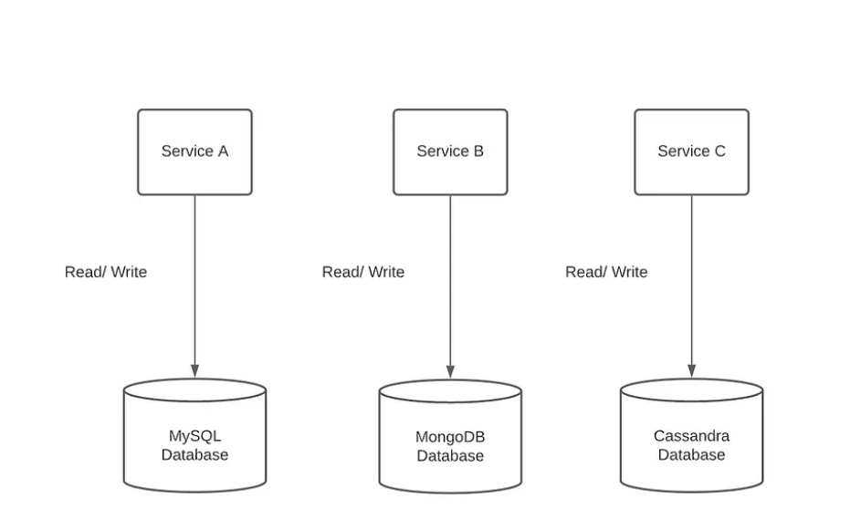
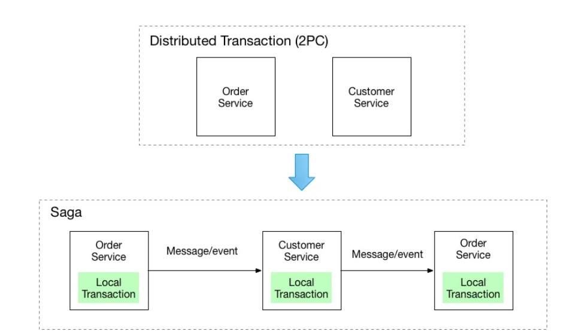

# 10 microservices design patterns for better architecture

Microservices are a software development technique that arranges an application as a collection of loosely coupled services. In a microservices architecture, services are fine-grained and the protocols are lightweight. The benefit of decomposing an application into different smaller services is that it improves modularity and makes the application easier to understand, develop, test, and become more resilient to architecture erosion.

The monolithic architecture was historically used by developers for a long time — and for a long time, it worked. Unfortunately, these architectures use fewer parts that are larger, thus meaning they were more likely to fail in entirety if a single part failed. Often, these applications ran as a singular process, which only exacerbated the issue.

Microservices solve these specific issues by having each microservice run as a separate process. If one cog goes down, it doesn’t necessarily mean the whole machine stops running. Plus, diagnosing and fixing defects in smaller, highly cohesive services is often easier than in larger monolithic ones.

## Key benefits of using microservices design patterns
- **Scalability**: Microservices can scale independently, allowing for more flexibility and efficiency.
- Creation of an application architecture that’s independently deployable and decentralized
- Massive scalability when and if needed
- New versions of microservices that can be rolled out incrementally, thus reducing downtime
- Detecting unwanted behavior before an old application version is completely replaced
- Use of multiple coding languages
- Prevention of systemic failure due to a root cause in an isolated component
- Real-time load balancing
- Independently deployable - e.g., the front-end service can be deployed independently of the authentication service
- Highly observable - through logging, monitoring, tracing, etc, one can determine what the service is doing
- Loosely coupled - the service can perform its work without being overly dependent on how any other service is defined or implemented
- Decentralized - spread across many different “systems,” potentially across many different geographies
- Highly testable - developed from the beginning to be testable through automated test frameworks with high coverage rates
- Highly maintainable - well-structured, well-commented, easy to understand, easy to change, easy and fast to build, etc (small size helps with all of this)
- Fungible - easily replaced or reimplemented as requirements dictate
- Focused and specialized - similar to the Unix philosophy of “do one thing well”
- Contractual - having regimented, well-defined interfaces with deliberate life cycles

## 7 Microservices Benefits
- Asymmetric Service Scaling
- Zero Downtime
- Intelligent Deployment
- Innovation Through Polyglot Programming
- Refactoring, Rewriting, and Decomposing
- Separation of Logic and Responsibilities
- Error Handling and Resiliency Design Patterns

1. Asymmetric Service Scaling: A company deploying software to their own intranet will have some known, upper bound on the maximum number of concurrent users. The software designed for that use case often has similar upper bounds on scalability. Conversely, a cloud-based service must scale to many users at many different companies using the software at the same time, perhaps orders of magnitude more users than a single intranet-based deployment. 
   - One of several microservices advantages is that it is well-suited for massive scalability, as each microservice can scale independently. To achieve this goal, the service must be “independently deployable” and “decentralized” to meet demand. A “highly observable” service provides metrics which can be used to drive scaling operations.
   - In addition, as the services scale in and out based on demand, underlying host resources can also scale in and out, thereby utilizing those resources more efficiently. This is in stark contrast to a dedicated company intranet deployment where resources may sit idle during low demand.

2. Zero Downtime: A direct follow-on from above, another benefit to microservices being “independently deployable” is zero downtime. A new version of a microservice can be incrementally rolled out, coexist with the old version, and eventually replace the old version.
    - Of course the service must be written to support this use case. Being stateless helps, as well as being “highly testable,” so as to confirm the new service is operating without any regression before completely replacing the old service.

3. Intelligent Deployment: Kubernetes is an open source orchestration tool that automates container deployment, scaling, and management (see below for more discussion of microservices and containers). Using a service mesh-enabled Kubernetes platform, canary testing of coexisting versions of a microservice is easily achieved. Weightings, HTTP headers, or a number of other criteria can be used to shape or route traffic to slowly ramp up work to the new service in a controlled manner. Unwanted behavior can be detected before the old version is completely replaced. If tests fail, a rollback to the old version of the microservice restores expected behavior.

4. Innovation Through Polyglot Programming: Let’s say a team is joining a project to introduce a new feature that will be very attractive to end-users. This existing project is written mostly in Go, but the new team consists mostly of node.js programmers. "Loosely coupled" and “contractual” microservices provide the ideal environment for a polyglot programming model as teams can choose whichever language they prefer in order to produce the new feature quickly. Since speed to market can be a huge business differentiator, this is another key microservices benefit.

    - It can be debated whether mixing languages may have disadvantages. However, if a particular team is much more familiar with one language than another, it is also much more likely that they’ll write “highly maintainable” code in that familiar language.

    - Or maybe teams are just interested in trying new technology and are willing to experiment with a new language. If that experiment doesn’t work, no problem--microservices are “fungible” so just rewrite the microservice.

5. Refactoring, Rewriting, and Decomposing: In the aforementioned polyglot programming model, a legacy, monolithic application can be decomposed into microservices over time. This incremental progression enables the other benefits of microservices while the legacy application is still being phased out.

    - See Analyzing Polyglot Microservices for a more in-depth look at polyglot programming in a microservices context.
6. Separation of Logic and Responsibilities: Very large projects are usually very complicated. No one team can know everything. Furthermore, for compliance or security purposes, teams may be purposely cordoned off from other areas of the project. A “loosely coupled,” “independently deployable,” “specialized,” and “contractual” microservice allows teams to focus their efforts on the business logic in their area of expertise or access.
7. Error Handling and Resiliency Design Patterns: It is a fact of life that failure is unpreventable, so if you fail, fail small. The circuit breaker pattern is often used to prevent systemic failure due to a root cause in an isolated component. As microservices communicate with each other to perform work, one way to introduce the circuit breaker pattern is to insert control points between the microservices. As an example, a service mesh-enabled Kubernetes platform provides built-in mechanisms to introduce circuit breakers and leverage the benefits of microservices.

# Microservices Design Patterns

## 1. API Gateway
An API Gateway acts as a single entry point for all clients, routing requests to the appropriate microservice. It handles functions like authentication, rate limiting, and response aggregation, improving client-to-microservice communication.

## 2. Circuit Breaker
The Circuit Breaker pattern prevents system failures by stopping requests to a failing service until it recovers. It detects failures quickly and provides fallbacks, enhancing the system's resilience.

- The Circuit Breaker design pattern is typically used in synchronous service communications, particularly when a service experiences high latency or becomes unresponsive. This pattern helps prevent cascading failures across multiple systems by stopping calls to an unresponsive microservice, which in turn protects system resources from being overwhelmed.
- Implementation involves creating a monitoring object that detects failure conditions. When a failure threshold is reached, the circuit breaker "trips," causing all subsequent calls to return an error or a default error message rather than executing the desired function.

There are three key states of the circuit breaker:

Open: In this state, the number of failures has exceeded the threshold. The circuit breaker rejects calls, resulting in errors without executing the service function.

Closed: This is the default state where all calls are processed normally. Ideally, a circuit breaker remains in this state for optimal performance.

Half-open: This state indicates that the circuit breaker is testing for underlying issues. Some calls may succeed, while others may fail, depending on the initial cause of the state change.

## 3. Service Discovery
Service Discovery allows microservices to find each other using a service registry. It dynamically manages the network locations of services, ensuring they communicate seamlessly without hard-coded configurations.

## 4. Database per Service

### Dedicated database for each service: 
A database dedicated to one service can’t be accessed by other services. This is one of the reasons that makes it much easier to scale and understand from a whole end-to-end business aspect.

In the Database per Service pattern, each microservice has its own database. This ensures data autonomy and prevents different services from becoming tightly coupled, allowing independent scaling and deployment. 

### Single Database Shared by All Services
While a single shared database is not typically considered a best practice in microservices architecture, it can be an alternative worth discussing. One of the main drawbacks of using a shared database is that it compromises several key benefits of microservices, such as scalability, robustness, and service independence.

However, there are scenarios where sharing a single database may be appropriate. If all services access the same physical database, it's crucial to establish clear logical boundaries within it. For instance, each service should have its own schema, and read/write access must be limited to prevent services from interfering with one another’s data.
## 5. Saga Pattern
The Saga pattern is used for managing distributed transactions. It breaks them into smaller, local transactions that can be coordinated using either:
    
- **Choreography**: Each service reacts to events and triggers subsequent events.
- **Orchestration**: A central orchestrator manages the flow of transactions.

## 6. Choreography and Orchestration
- **Choreography** involves decentralized coordination where services respond to events without a central controller.
- **Orchestration** uses a central entity to control and manage the interactions between services.

## 7. Strangler Fig Pattern
This pattern is used to gradually migrate from a legacy system to a microservices architecture. The old functionality is replaced with microservices over time without disrupting the existing system.

## 8. Bulkhead Pattern
The Bulkhead pattern isolates different services or components in a system. This prevents failures in one area from cascading to others, improving fault tolerance and system reliability.

## 9. Event Sourcing
Event Sourcing involves storing the state changes of an application as a series of events. This approach ensures that every state change is recorded, allowing for robust data recovery and audit trails.

## 10. CQRS (Command Query Responsibility Segregation)
CQRS separates the read (query) and write (command) operations in a system. This separation optimizes data operations, allowing different models for data retrieval and updates, enhancing performance and scalability.

## Microservices Disadvantages
It’s important to understand both pros and cons when considering if a microservices architecture is right for your organization. We discussed microservices advantages above. Here we’ll cover a few perceived problems with microservices.

- Earlier we discussed the size of a microservice and how that shapes its scope. Taken to an extreme, a microservice can be too small. If a microservice is too small, it may spend most of its time communicating with other microservices, introducing latency and generally just thrashing. 
  - In turn, other microservices can be slowed by this thrashing as well, especially if using a message bus for inter-service communication as the bus will become saturated with messages (in this case a circuit breaker pattern can help, but is likely just a crutch so beware).

- Microservices running in containers that are managed by a Kubernetes platform can be complicated to set up.
- A project must be large enough to justify the overhead required to manage the microservices, deployment automation, and infrastructure.
- Again, size can be arbitrary. If the team(s) working on the project feel they understand the entire scope of the project well enough, chances are a simpler, monolithic architecture may be better suited. 
- However, if you anticipate a large, complex project with lots of uncertainty, the benefits of a microservices architecture may suit your purposes perfectly.
- some teams find the loosely coupled nature of microservices to be an information barrier. If a microservice was implemented with insufficient observability, determining what it does can be complicated. Service meshes are great for introducing observability, but like all powerful tools, if used incorrectly, service meshes can introduce enormous complexity and unintuitive behavior.